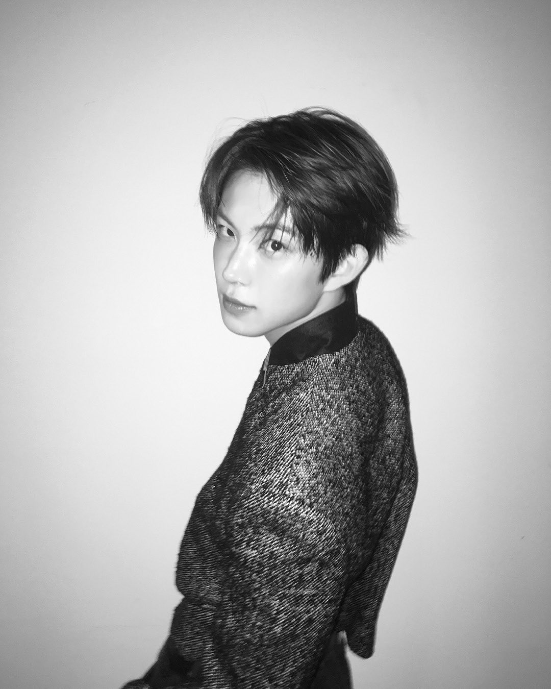
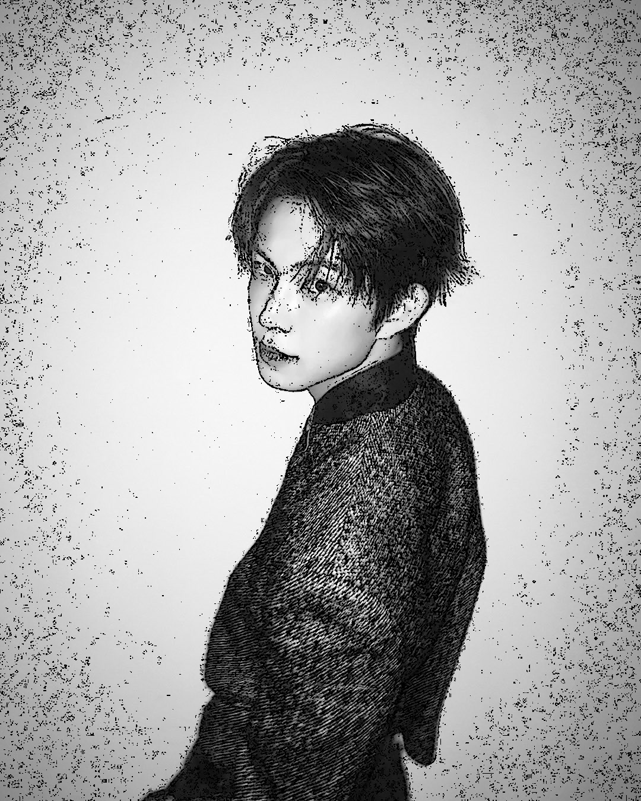
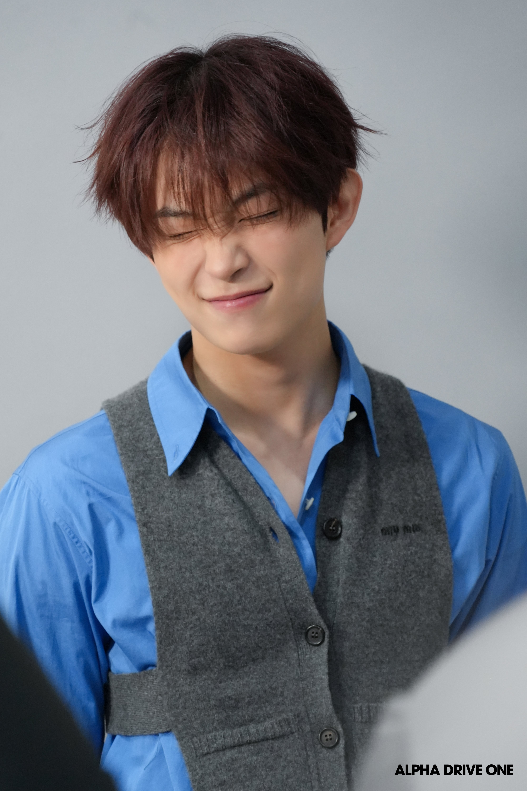

# Cartoon Rendering using OpenCV

## 🎯 Project Goal
The goal of this assignment is to transform a standard photograph into a "Cartoon Style" image using Computer Vision and Image Processing techniques.

## 🛠️ Technical Implementation
For this project, I focused on **High-Definition Detail Preservation**. Most cartoon filters use heavy smoothing, which loses fine details. My approach intentionally skips certain steps to achieve a sharper, ink-sketch look.

- **Grayscale Conversion:** Converting the image to a single-channel intensity map.
- **CLAHE (Contrast Enhancement):** Applied to boost local contrast, ensuring that thin lines and hair strands are visible to the edge detector.
- **Adaptive Thresholding:** Used with a minimal **Block Size of 3** to extract the most intricate details as black ink lines.
- **No Smoothing (Bilateral Filter):** I intentionally omitted the bilateral filter to prevent the "plastic/blurred" look, aiming instead for a detailed ink-sketch aesthetic.

---

## 📊 Demo Results & Discussion

### 1. Success Case: Effective Cartoon Effect 
| Original | Cartoon Result (Success) |
| :---: | :---: |
|  |  |

**Analysis:** This result is highly successful in creating a "Detailed Ink" style. By skipping the smoothing process, the algorithm managed to **"save" every individual strand of hair**, which is usually lost in standard cartoon filters. The bold black outlines give it a strong, hand-drawn artistic feel.

### 2. Failure Case: Ineffective Cartoon Effect 
| Original | Failed Result (Too Realistic) |
| :---: | :---: |
|  |  |

**Analysis:** This image is considered a failure because the "Cartoon" identity is too weak, and the result looks almost identical to the original photo.
- **The Problem:** Although you can see fine lines around the hair, the overall image fails to look like a cartoon.
- **Reason:** Because the original colors and natural gradients were preserved without any smoothing or color simplification (Color Quantization), the "realistic" look of the photograph remains dominant.
### 3. Discussion on Limitations 
The primary limitation of this algorithm is the **Trade-off between Detail and Stylization**.
- **The Realism Trap:** By prioritizing hair detail and keeping the original color space, the algorithm struggles to break away from "photorealism."
- **Style Constraint:** Without a dedicated color-flattening step, the output often remains too grounded in reality, making it a "Detailed Sketch" rather than a true "Cartoon."

---

## 💻 How to Run
1. Install OpenCV: `pip install opencv-python`
2. Run the script: `python main.py`
